# ARCV

**Arwes-style sci-fi HUD, rendered with ModernGL GLSL shaders over a live OpenCV camera feed.**

ARCV recreates the look of the [Arwes](https://github.com/arwes/arwes) web UI framework
— glowing cyan bracket frames, line draw-on animation, decipher text, scanlines, bloom,
radial glow — as a **GPU-rendered HUD drawn over a camera feed**, in Python. The HUD is
**fully CV-reactive**: brackets, reticles and labels lock onto faces / objects / edges
detected by OpenCV every frame.

It does **not** replace OpenCV or ModernGL — it's a thin layer on top:

| Layer | Role |
|-------|------|
| **OpenCV** | camera capture + computer vision (faces, edges, contours) |
| **ModernGL** | GPU draw + multi-pass HDR bloom that gives the Arwes-quality glow |
| **ARCV** | the Arwes visual vocabulary + an Animator orchestration model |

ARCV is **library-only**: you own the window + GL context + main loop. You create a
`Scene` against an existing `moderngl.Context`, feed it frames, and call `render()`.

---

## Showcase

**CV-reactive HUD** — brackets/reticles/labels lock onto detections, over a grid + data-rain background:


**Autonomous quadruped follow-HUD** — a hand-laid overlay that *boots up*, then plays
LOCKED → **TARGET LOST** (red alert + searching) → REACQUIRE, with synchronized bleeps
([examples/robot_hud.py](examples/robot_hud.py)):

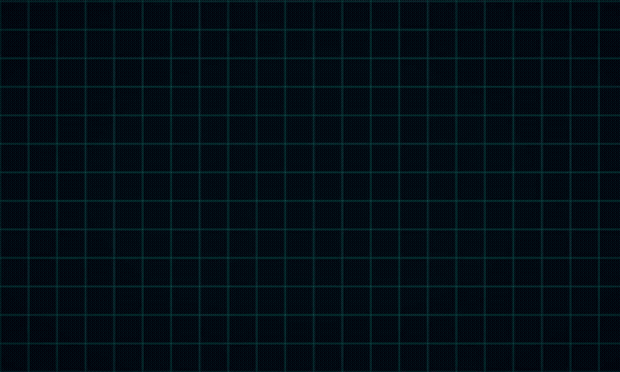

| Locked (following) | Target lost (searching) |
|---|---|
| 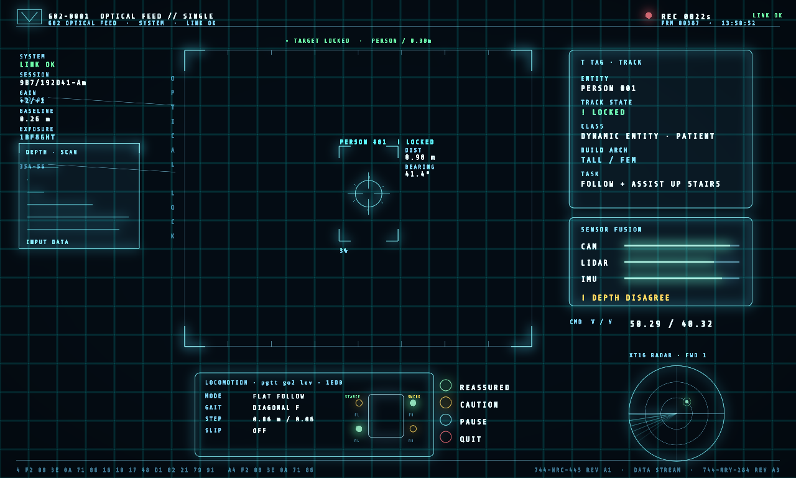 | 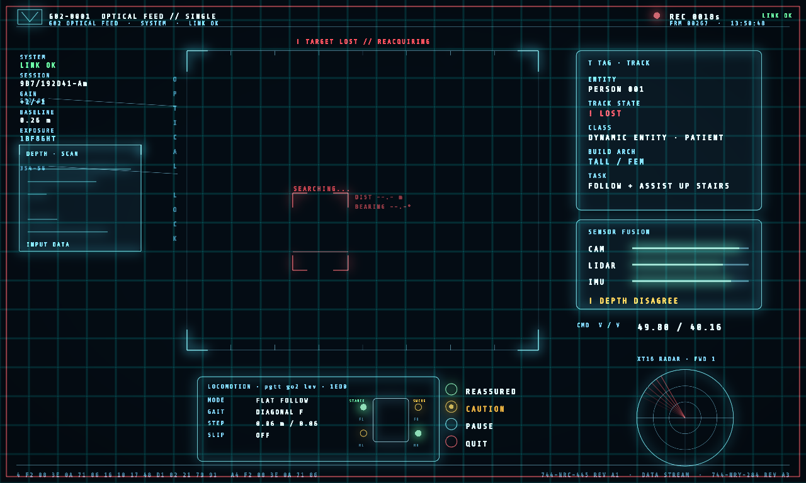 |

**Cyberpunk-2077 scanner HUD** — the same layout rendered by plain OpenCV (CPU) vs ARCV
(GPU), and the animated boot sequence ([examples/hud_cyberpunk_compare.py](examples/hud_cyberpunk_compare.py)):

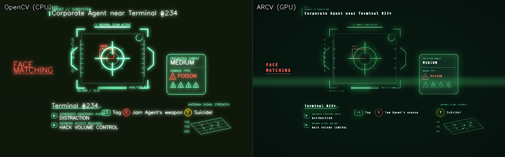

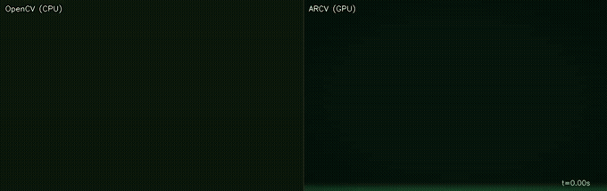

**Frame styles** (`nefrex / corners / lines / octagon / underline / kranox`) and **theme presets** (`make_theme("amber")`, …):

| Frames | Themes |
|---|---|
| 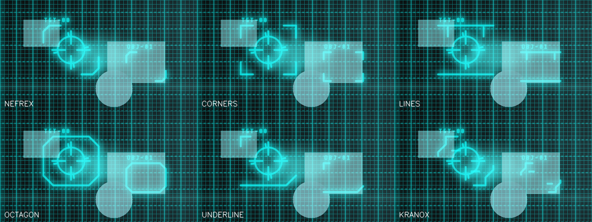 | 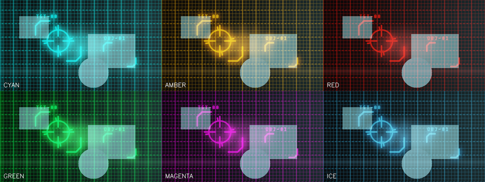 |

**HUD reference recreations** — five external HUD reference images rebuilt with the
`arcv.overlay.hud_kit` primitives, then graded against the originals until *remarkably
similar* (each row: reference **|** ARCV render):

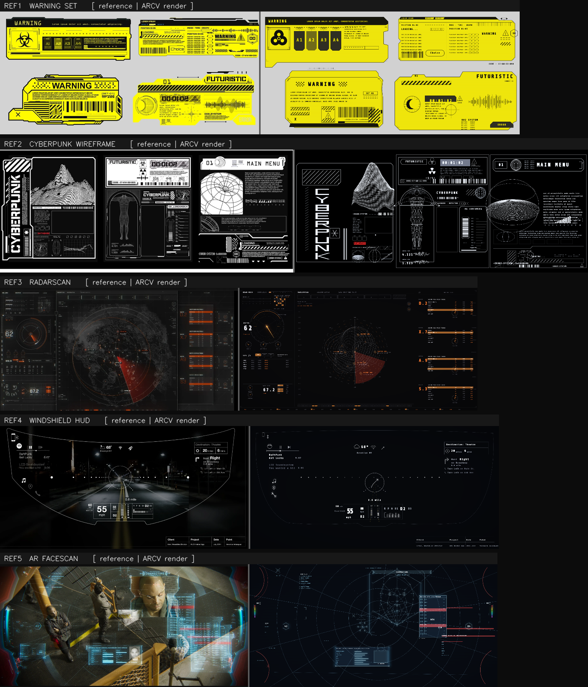

---

## Why GPU? (OpenCV vs ARCV)

Both do the same two things — render the feed and annotate detections — on the same
frame and the same detections. On Intel UHD integrated graphics at 640×360:

```
=== HUD render cost (capture + detection excluded, shared) ===
OpenCV (CPU):  mean 13.89 ms  p95 16.33 ms  ~ 72 fps
ARCV  (GPU):   mean  3.02 ms  p95  5.20 ms  ~331 fps
speedup: 4.60x
```

The OpenCV baseline's per-frame `GaussianBlur` + draw cost grows with resolution; ARCV's
fullscreen GPU passes stay roughly flat — and the glow/animation quality is well beyond a
CPU blur. Run it yourself:

```bash
python examples/compare.py --bench 200     # headless numbers
python examples/compare.py --camera 0      # live split window
python examples/compare.py --save out.png  # a still side-by-side
```

---

## Install

```bash
pip install -e .                 # core: moderngl, numpy, opencv-python, Pillow
pip install -e ".[window]"       # + moderngl-window, glfw  (only for the live window demo)
pip install -e ".[dev]"          # + pytest
```

Requires OpenGL 3.3+ (all shaders target GLSL `330 core`, so Intel integrated GPUs work).

---

## Quickstart (library)

You provide the GL context and the loop; ARCV does the rest.

```python
import moderngl
from arcv import Scene, Theme, DetectorPipeline, CameraSource

ctx = moderngl.create_context()          # from your window (glfw/pyglet/pygame/qt)
scene = Scene(ctx, size=(1280, 720), theme=Theme(), detector=DetectorPipeline())

with CameraSource(0) as cam:
    while running:                       # your loop
        frame = cam.read()               # uint8 (H,W,3) BGR
        if frame is not None:
            scene.submit(frame)          # upload + detect + track ids
        scene.render(time_seconds)       # 4-pass pipeline -> ctx.screen
        window.swap_buffers()
```

Want apples-to-apples sharing of detections (e.g. for the comparison)? Run detection
yourself and pass it in:

```python
detections = pipeline.process(frame)
scene.submit(frame, detections)
```

`scene.resize(w, h)` on window resize, `scene.set_mouse(x, y)` to drive the cursor glow,
`scene.render(t, target=fbo)` to render into your own framebuffer instead of the screen.

---

## What's in the HUD

Every element is a GLSL recreation of an Arwes visual, driven by the Animator
(`exited → entering → entered → exiting`, enter/exit 0.4 s):

- **Frames** (`frame_style=`) — `nefrex`, `corners`, `lines`, `octagon`, `underline`,
  `kranox`. Each *draws on* via arc-length reveal of signed-distance polylines, one per
  detection.
- **Text** (`text_style=`) — `decipher` (scramble/decode) or `typeon` (typewriter +
  blinking cursor), from a monospace glyph atlas.
- **Backgrounds** (`backgrounds=`) — `dots`, `gridlines`, `movinglines` (speed scales
  with optical flow), `puffs`.
- **Reticle** — targeting crosshair + rotating ticks locked to the primary target.
- **EdgeTrace** — the Canny edge mask drawn as glowing cyan contours.
- **TrackerDots** (`show_keypoints=True`) — markers at ORB keypoints.
- **Illuminator** — soft radial glow that follows the cursor.
- **Bloom** — HDR bright-pass + separable Gaussian **ping-pong** blur (the real glow).
- **ScanlineOverlay / ColorGrade / vignette** — applied in the composite pass.

Render passes each frame: **camera + grade → HUD (own FBO) → bloom → composite**.

```python
scene = Scene(ctx, (1280, 720),
              frame_style="octagon",
              text_style="typeon",
              backgrounds=("gridlines", "movinglines"),
              show_keypoints=True)
```

Available names are also exposed as `arcv.FRAME_STYLES`, `arcv.BACKGROUND_STYLES`,
`arcv.TEXT_STYLES`. Try them live:

```bash
python examples/preview_static.py --frame kranox --text typeon --bg gridlines,movinglines --keypoints
```

---

## Examples

| Script | Needs | What it does |
|--------|-------|--------------|
| `examples/preview_static.py` | core only | HUD over a still image or synthetic scene (headless `--save` or window) |
| `examples/compare.py` | core only | OpenCV vs ARCV side-by-side + FPS (`--bench`, `--save`, `--camera`, `--image`) |
| `examples/minimal_glfw.py` | `[window]` | live resizable window driven by a webcam |

The headless examples create an offscreen `moderngl.create_standalone_context()` and show
results via OpenCV — no window library required.

---

## Tests

```bash
pytest                 # all
pytest tests/test_animator.py tests/test_theme.py tests/test_detectors.py   # no GPU
pytest tests/test_shaders_smoke.py                                          # offscreen GL
```

The smoke test compiles every shader and renders one frame to an offscreen FBO against a
synthetic frame + detections — it catches GLSL errors without a camera or display.

---

## Project layout

```
arcv/
  scene.py            # Scene: ctx-driven orchestration (submit/render/resize/set_mouse)
  animator.py         # Arwes animator state machine (pure Python)
  theme.py            # palette tokens / createThemeColor port
  geometry.py         # fullscreen triangle helpers
  capture/camera.py   # threaded cv2.VideoCapture
  vision/             # detectors + DetectorPipeline -> normalized DetectionFrame
  components/         # one class per Arwes element (frames/ text/ effects/)
  overlay/            # no-camera HUD kit: renderer.py, batch.py, anim.py,
                      #   draw.py (pixel Draw surface), hud_kit.py (reusable primitives)
  passes/             # camera / hud / bloom / composite render passes
  shaders/            # GLSL 330 .vert/.frag
examples/             # preview_static, compare, minimal_glfw, opencv_baseline
  refs/               # reference-image recreations + _ref_render.py harness + gallery
tests/
```

## Themes, DNN faces, multi-camera (Phase 3)

```python
from arcv import make_theme, DetectorPipeline, enumerate_cameras

scene = Scene(ctx, size,
              theme=make_theme("amber"),     # cyan|amber|red|green|magenta|ice (+ overrides)
              upload="double")               # double-buffered (PBO-style) camera upload

# DNN face detector with landmarks (falls back to Haar if the model is missing)
import arcv.vision.detectors as d
d.download_yunet()                            # one-time, needs network
pipe = DetectorPipeline(face_backend="yunet")

cams = enumerate_cameras()                     # -> e.g. [0, 1]; also MultiCameraSource
```

- **Theming presets** (`make_theme(...)`) re-hue the whole HUD; pass any `Theme` field as an override.
- **YuNet DNN faces** (`face_backend="yunet"`) — more robust than Haar, adds 5 facial
  landmarks (rendered as tracker dots). Auto-falls back to Haar if the ONNX model isn't found.
- **Double-buffered upload** (`upload="double"`) decouples the texture write from the
  in-flight GPU read (ModernGL doesn't expose true PBO mapping, so we alternate textures).
- **Multi-camera** — `enumerate_cameras()` + `MultiCameraSource(indices).switch()/next()`.

CLI: `python examples/preview_static.py --theme amber --frame octagon --faces yunet --upload double --bg gridlines,movinglines --keypoints`

## Overlay UI kit (hand-laid-out HUDs, no camera)

`arcv.Overlay` lets you place Arwes-style elements at fixed positions and render
them through the same HDR bloom/composite pipeline — for static HUDs, menus,
panels, and titles rather than detection-driven brackets.

```python
from arcv import Overlay, make_theme

ov = Overlay(ctx, (1280, 800), theme=make_theme("green"))
ov.begin()
ov.vector.rounded_rect(40, 40, 300, 200, 12, ov.theme.stroke)   # panel
ov.vector.ring(640, 400, 60, ov.theme.stroke)                   # reticle
ov.text.text("THREAT // MEDIUM", 56, 56, 18, (0.9, 1, 0.95, 1)) # label
ov.render(time, target=fbo)
```

`ov.vector` has `line / polyline / rect / rounded_rect(_fill) / ring / arc /
disc / triangle_*`; `ov.text` does colored decipher/type-on/plain glyphs.

### HUD kit primitives (`arcv.overlay.hud_kit`)

A curated library of reusable, deterministic HUD building blocks — the genuinely
reusable pieces distilled from the reference recreations. Each takes a
pixel-coordinate drawing surface `Draw(overlay)` (or any duck-typed equivalent)
as its first argument; colors are RGBA floats and coordinates are pixels.

- **Icons / badges** — `warning_triangle`, `biohazard`, `radiation_trefoil`,
  `hexagon`, `hex_badge`, `crescent`
- **Textures / strips** — `hazard_stripes` (clipped diagonal caution stripes),
  `barcode`, `waveform`, `spectrum_bar` (rainbow), `segmented_bar`
- **Gauges / radar** — `tick_ring`, `radial_gauge` (progress arc + needle),
  `sweep_wedge` (translucent radar sector), `contour_map` (organic topographic
  loops)
- **Wireframe** — `wireframe_sphere` (plain globe or swirling `vortex`),
  `wireframe_terrain` (tilted 3D mesh), `face_mesh` (triangulated AR face)

```python
from arcv.overlay import Overlay, Draw, hud_kit
ov = Overlay(ctx, (1280, 720)); d = Draw(ov)
ov.begin()
hud_kit.radial_gauge(d, 200, 200, 90, 0.62, (0.9,0.45,0.15,1), needle_deg=58)
hud_kit.wireframe_sphere(d, 640, 360, 120, (0,1,1,1), vortex=True)
hud_kit.hazard_stripes(d, 40, 40, 400, 70, (1,0.8,0,1))
ov.render(0.0, target=fbo)
```

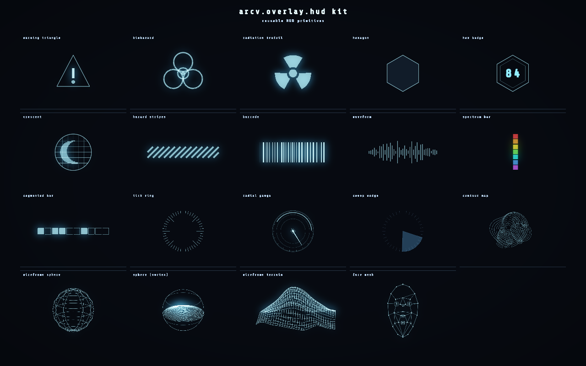

Built while recreating five external HUD references (see
`examples/refs/refN_layout.py`). Regenerate the contact sheets with
`python examples/refs/make_gallery.py` + `python examples/refs/kit_demo.py`
(committed copies land in `docs/media/`).

### Reference recreations

Five external HUD reference images, each recreated with this kit and graded
against the original until *remarkably similar* (sources under `examples/refs/`):

| Ref | Reference | ARCV render | Score |
|---|---|---|---|
| **REF1** warning set | 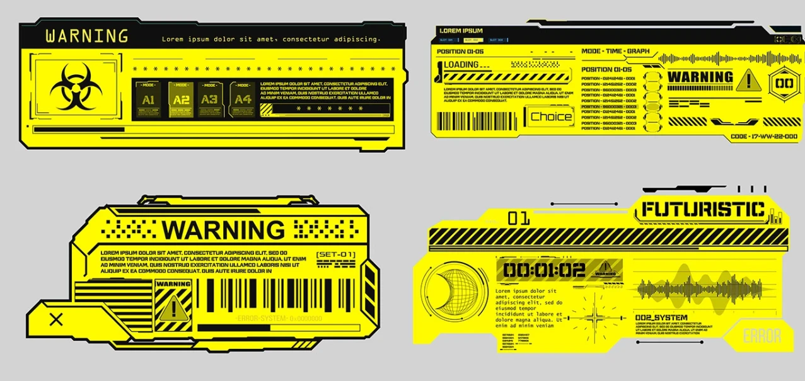 | 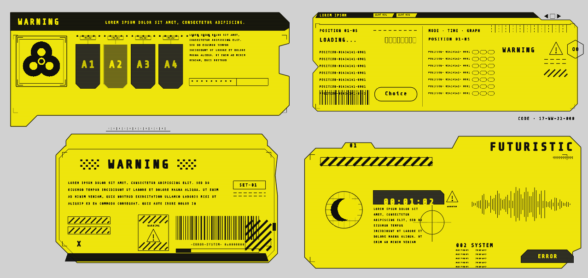 | ~8.5 |
| **REF2** cyberpunk wireframe | 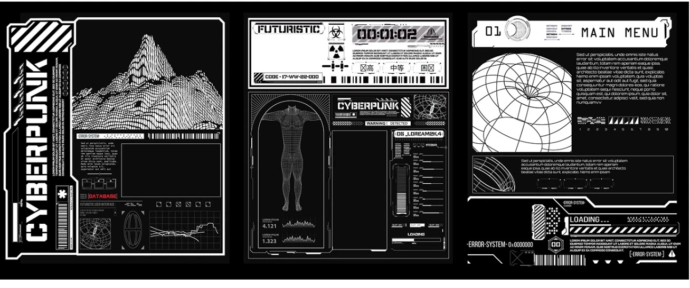 | 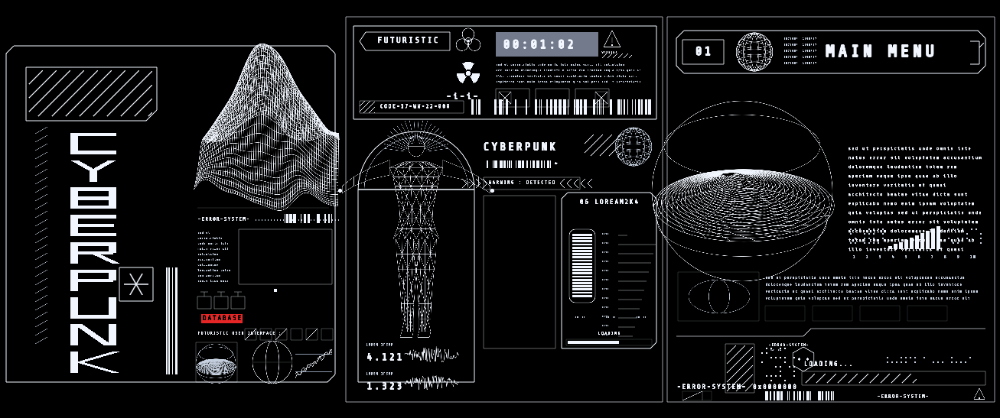 | ~9 |
| **REF3** radarscan | 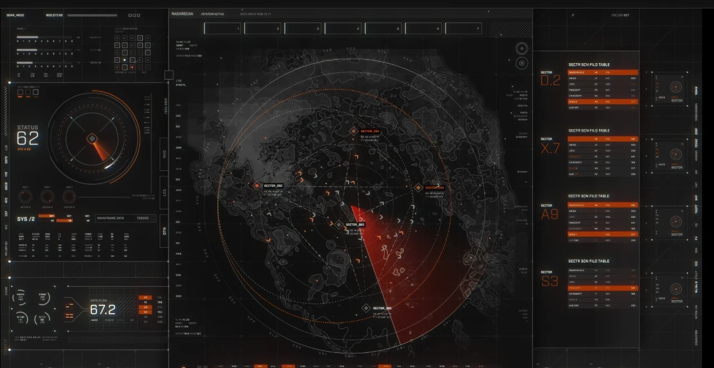 | 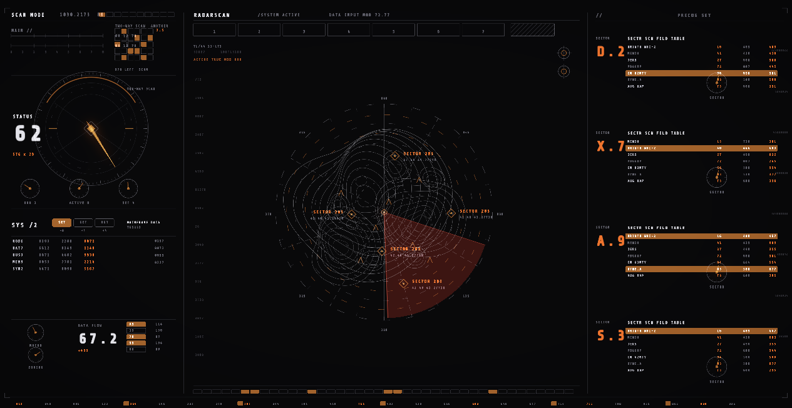 | ~8.5 |
| **REF4** windshield | 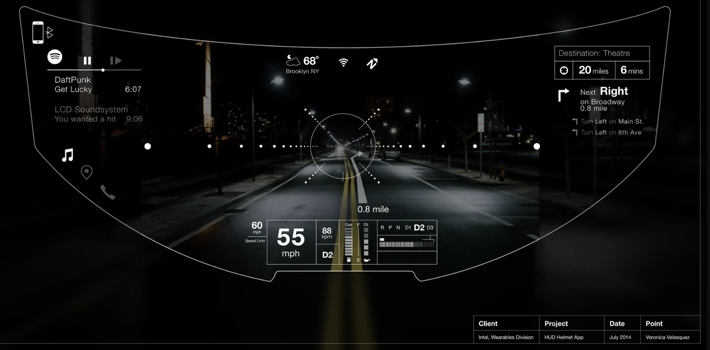 | 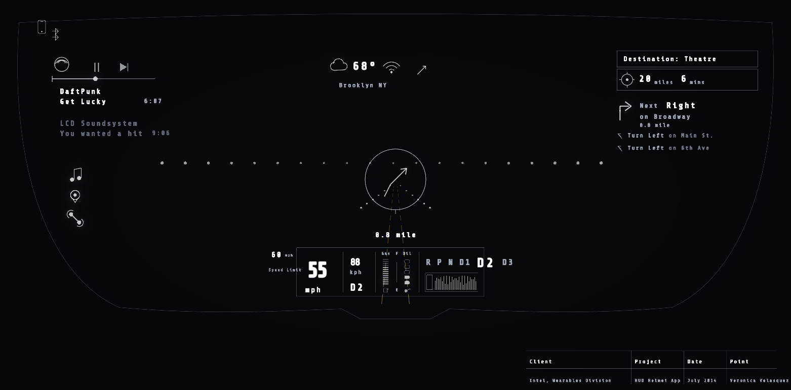 | ~9 |
| **REF5** AR facescan | 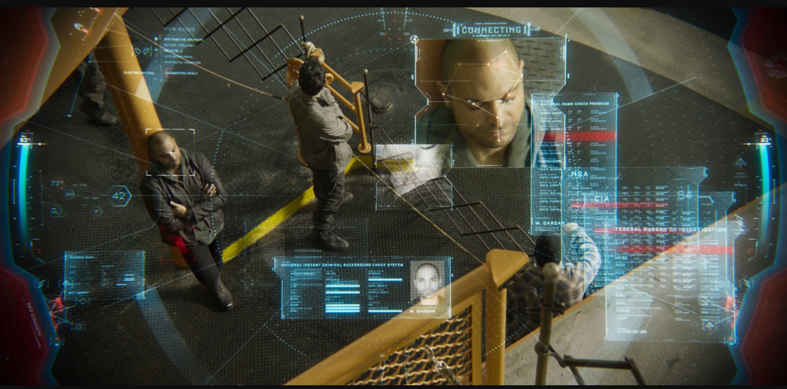 | 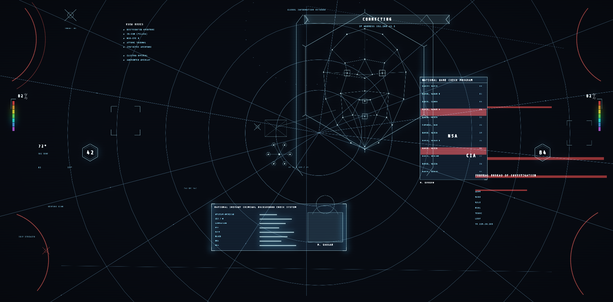 | ~9 |

Full-size side-by-side: [`hud_recreations.png`](docs/media/hud_recreations.png).
Each was authored as a self-contained layout through the shared `_ref_render.py`
harness — `glow` (additive + HDR bloom) or `flat` (premultiplied-over, for opaque
dark-on-light art like the yellow warning panels). REF4/REF5 render the HUD on a
dark base (the original photo plates aren't included).

**Worked example — autonomous quadruped follow-HUD** ([examples/robot_hud.py](examples/robot_hud.py),
[examples/robot_hud_layout.py](examples/robot_hud_layout.py)): a robot-dog tracking
overlay driven by a scripted state machine — boot/assemble → **LOCKED** follow →
**TARGET LOST** (full-screen red alert, broken searching reticle, radar blip gone,
CAUTION pulsing) → **REACQUIRE**. Shows a person bounding box + reticle, depth-scan
panel, sensor-fusion bars, gait diagram (stance/swing), radar sweep, action buttons,
and a hex data stream, with lock/lost/reacquire bleeps.

```bash
python examples/robot_hud.py              # gif + timeline + mp4 (with audio)
python examples/robot_hud.py --live --sound
```

**Animation / loading effects.** The overlay has an Arwes-style motion layer
(`arcv.overlay.anim`): a `Sequencer` for staggered enter/loading orchestration,
easings, **arc-length stroke reveal** (frame draw-on), and **flicker-in**. Strokes
take a `reveal=0..1`, text takes `mode="decipher"|"typeon"` + `progress`, so a
whole HUD can *boot up* — draw on, decipher/type, stagger, with loading spinners
and progress bars.

```python
from arcv.overlay import Sequencer
q = Sequencer(time)
ov.vector.rounded_rect(x0, y0, x1, y1, r, c, reveal=q.at(0.2, 0.4))   # draws on
ov.text.text("MEDIUM", x, y, 18, c, mode="decipher", t=time, progress=q.at(0.5, 0.4))
```

**Worked example — the Cyberpunk-2077 scanner HUD**, authored once
([examples/cyberpunk_layout.py](examples/cyberpunk_layout.py)) and rendered
through both backends:

```bash
python examples/hud_cyberpunk_compare.py --save out.png   # static side-by-side
python examples/hud_cyberpunk_compare.py --sound          # live window + bleeps
python examples/hud_cyberpunk_anim.py                     # boot GIF + timeline + MP4 w/ audio
```

OpenCV draws it with cv2 + a GaussianBlur glow; ARCV with GPU vector/text batches
+ HDR ping-pong bloom and the animated scanline sweep. The boot sequence (strokes
drawing on, text deciphering/typing, staggered panels, loading spinner + analysis
bar, flicker-in) runs identically on both — the difference is render quality.

**Audio / bleeps.** `arcv.audio` plays HUD sounds live, event-driven, off the
same timeline. Two sources:

- `source="arwes"` — the **real Arwes bleep sounds** (hover/type/click/error/
  intro/assemble/info/open/close), decoded from the bundled mp3s via ffmpeg and
  mapped to ARCV events; falls back to synth per-missing-sound.
- `source="synth"` (default) — procedurally generated blips, **no asset files**.

```python
from arcv.audio import Bleeps, download_arwes_sounds
# download_arwes_sounds()                    # one-time fetch of the Arwes mp3s
bleeps = Bleeps(volume=0.6, source="arwes")  # sounddevice → winsound → silent
scene = Scene(ctx, size, detector=pipe, bleeps=bleeps)  # lock-on / target-lost sounds
```

Playback is non-blocking (sounddevice mixer, winsound fallback, silent if no
device). For a shareable clip, `hud_cyberpunk_anim.py` bakes the cue list into an
audio track and **muxes it onto an MP4** via ffmpeg (h264 + aac) — "during" for
the live HUD, timeline-baked only for the video export. `ffmpeg` is optional
(needed only for the Arwes-sound decode and the MP4 mux; synth + live playback
work without it).

## Roadmap

- **Phase 1 — done.** Camera pipeline, animator, theme, FrameNefrex, decipher text,
  reticle, edge-trace, illuminator, 4-pass HDR bloom, scanlines, comparison harness.
- **Phase 2 — done.** All frames (Corners/Lines/Octagon/Underline/Kranox), backgrounds
  (dots/gridlines/moving-lines/puffs), type-on text, optical-flow & ORB detectors with
  tracker dots, detection-id enter/exit transitions.
- **Phase 3 — done.** Theming presets, YuNet DNN faces + landmarks, double-buffered
  (PBO-style) upload, multi-camera. The package is feature-complete.
